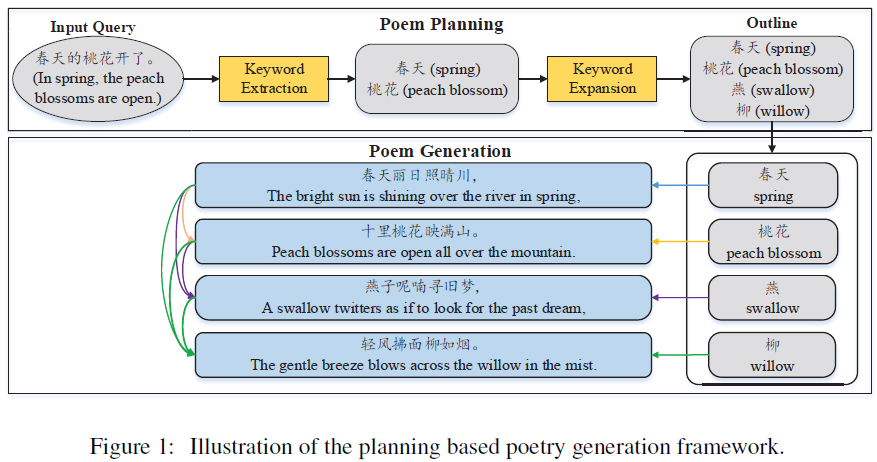
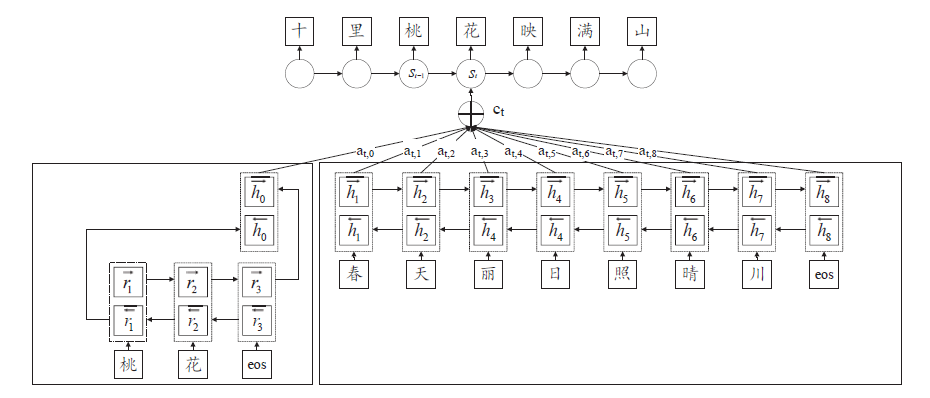

# Chinese Poetry Generation with Planning based Neural Network

>> Zhe Wang, Wei He, Hua Wu et al. 2016, arxiv

Reference Code: [TensorFlow Code](https://github.com/Disiok/poetry-seq2seq), [Pytorch Code](https://github.com/jhave/pytorch-poetry-generation), [C++ Code](https://github.com/XingxingZhang/rnnpg)

## Overview

Two-stage procedure: The content of poems ("what to say") are first explicitly planned, and surface realization ("how to say") is conducted.

1. Given input query which can be a set of keywords, a sentence or a document, the first step if to determine a sequence of sub-topics for the poem using a porm planning model, with each line represented by a sub-topic.
2. The the poem is generated line by line, and each line is generated according to the corresponding sub-topic and the preceding generated lines.

## Methodolody

### Poem Planning

#### Keyword Extraction

TextRank algorithm, a graph-based ranking algorithm based on PageRank:
$$S(V_i)=(1-d)+d \sum \limits_{V_j \in E(V_i)}\frac{w_{ji}}{\sum_{V_k \in E(V_j)}w_{jk}}S(V_j)$$

where $w_{ji}$ is the weight of the edge between node $V_j$ and $V_i$, $E(V_i)$ is the set of vertices connected with $V_i$, and $d$ is a dampling factor that usually set to 0.85, and the initial score of $S(V_i)$ is set to 1.0.

#### Keyword Expansion

1. RNNLM-based method:
   $$k_i=\arg \max_k P(k|k_{1:k-1}) $$
   Predict the subsequent keywords according to the preceding sequence of keywords.

2. Knowledge-based method:
   The above RNNLM-based method is only suitable for generating sub-topics for those covering by the colected poems.

   Retrieve those satisfying all the following conditions from encyclopedia as candidate keywords:
   1. the wordis is in the window of [-5, 5] around $k_i$
   2. the part-of-speech of the word is adjective or noun
   3. the word is covered by the vocabulary of the poem corpus

   Then the candidate words with highese TextRank score are selected as the keywords.

### Poem Generation

Given a keyword $k$ which has $T_k$ characters and the preceding text $x$ which has $T_x$ characters, we first encode $k$ into a sequence of hidden states $[r_1:r_{T_k}]$, and $x$ in $[h_1:h_{T_x}]$, with GRU models. Then we integrate $[r_1:r_{T_k}]$ into a vector $r_c$ by concatenating the last forward state and the first backward state of $[r_1:r_{T_k}]$, where

$$r_c=\begin{bmatrix} \overrightarrow{r_{T_k}} \\ \overleftarrow{r_1} \end{bmatrix}$$

we set $h_0=r_c$, then the sequence of vectors $h=[h_0:h_{T_x}]$ represents the semantics of both $k$ and $x$. The first line is actually generated from the first keyword with $T_x = 0$.

In decoder, the most probable output $y_t$ can be formulated as follows:

$$y_t=\arg \max_y P(y|s_t,c_t,y_{t-1})$$
where $s_t$ is an internal status vector of GRU, $c_t$ is the context vector.

After each prediction, $s_t$ is updated by
$$s_t=f(s_{t-1},c_{t-1},y_{t-1})$$

$f(\cdot)$ is an activation function of GRU and $c_t$ is recomputed at each step by the alignment model:
$$c_t = \sum \limits_{j=0}^{T_h - 1}a_{tj}h_j$$
$h_j$ is the $j$-th hidden state in the encoder's output. $\alpha_{tj}$ is computed by
$$\alpha_{tj}=\frac{\exp(e_{tj})}{\sum_{k=0}^{T_h-1}\exp(e_{tk})} $$
where
$$e_{tj}=v_a^T\tanh(W_a s_{t-1}+U_a h_j) $$

$e_{tj}$ is the attention score on $h_j$ at time step $t$. The probability of the next word $y_t$ can be defined as:
$$P(y_t|y_1,\cdots,y_{t-1},\mathbf{x},\mathbf{k})=g(s_t,y_{t-1},c_t)$$
where $g(\cdot)$ is a nonlinear cunction that outputs the probability of $y_t$.

The parameters of the poem generation model are trained to maximize the log-likelihood of the training curpus:
$$\arg \max \sum \limits_{n=1}^N \log P(\mathbf{y_n}|\mathbf{x_n},\mathbf{k_n})$$