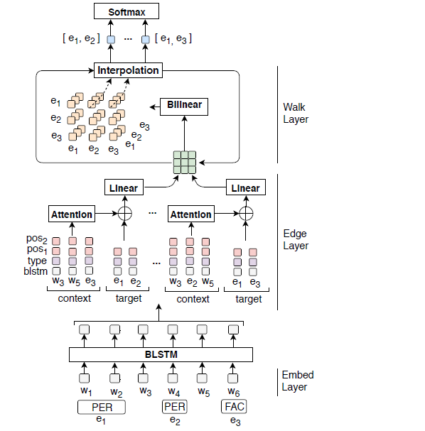

# A Walk-based Model on Entity Graphs for Relation Extraction

>> Fenia Christopoulou, Makoto Miwa, Sophia Ananiadou, 2018, ACL

## Motivation

A sentence typically contains multiple relations between entity mentions. RE models need to consider these pairs simultaneously to model the dependencies among them.

Besizes, for relation extaction from a sentence, related pairs are not predefined and consequently all entity pairs need to be considerd to extract relations. In addition, state-of-art RE models sometimes are domain dependent because of external syntactic tools.

## Overview

* We proposed a graph walk based neural model that considers multiple entity pairs in relation extraction from a sentence.
* We proposed an iterative algorithm to form a single representation for up-to $l$-length walks between the entities of a pair.

## Methodology

The proposed model consists of 5 stack layers: embedding layer, BLSTM layer, edge representation layer, walk aggregation layer and finally a classification layer.

### Embedding Layer

The embedding layer involves the creation of $n_w, n_t, n_p$-dimensional vectors which are assigned to words, semantic entity types and relative positions to the target pairs.

### Bidirectional LSTM Layer

The word representations of each sentence are fed into a BiLSTM layer, which encodes the context representation for every word. The BLSTM outputs new word-level representations $h$.

We avoid encoding target pair-dependent information in this BLSTM layer, which has two advantages:
1. the computational cost is reduced as this computation is repeated based on the number of sentences instead of the number of pairs.
2. we can share the sequence layer among the pairs of a sentence.

### Edge Representation Layer

The output word representations of the BLSTM are divided into two parts:
* target pair representations
* target pair-specific context representations

For entity pair $(e_i, e_j)$, the representation of the entity are as follows:

$$
v_i=[e_i;t_i;p_{ij}]
$$ 

where $e_i$ is the average of the BLSTM representations of the entity, $t_i$ is the representation of its entity type and $p_{ij}$ is its relative psition to entity $e_j$

The representation fro a context word $w_z$ of a target pair is

$$
v_{ijz}=[e_z;t_z;p_{zi};p_{zj}]
$$

where $e_z$ is the output of BLSTM, $t_z$ is type representaion and $p_{zi}$ and $p_{zj}$ are relative position representations.

The context words representations of each target pair are then compiled into a single representation with an attention machanism.

Finally, we concatenate the representations of the target entites and their context.

$$
v_{ij}^{(1)} = \mathbf{W}_s[v_i;v_j;c_{ij}] \in \mathbb{R}^{n_s}
$$

where $W_s$ is used to reduce the dimensionality of the resulting vector. The resulting vector coresponds to the representation of an edge or a one-length walk between nodes $i$ and $j$.

### Walk Aggregation Layer

The goal of this layer is to generate a single representation for a finite number of different lengths walks between two target entities.

The walk-based algorithm can be seen as a two-step process:

1. Two consecutive edges in the graph are combined using a modified bilinear transformation:
   
   $$
   f(v_{ik}^{(\lambda)}, v_{kj}^{(\lambda)}) = \sigma(v_{ik}^{(\lambda)}\ \odot \ (\mathbb{W}_b \ v_{kj}^{(\lambda)}))
   $$ 

   where $v_{ij}^{(\lambda)}$ coresponds to walks representation of lengths one-to-$\lambda$ between entities $e_i$ and $e_j$. This equation results in walks of lengths two-to-$2\lambda$.
2. Linearly combine the initial walks (length one-to-$\lambda$) and the extended walks (length two-to-$2\lambda$):
   
   $$
   v_{ij}^{(2\lambda)} = \beta v_{ij}^{(\lambda)} + (1-\beta) \sum \limits_{k \neq i,j} f(v_{ij}^{(\lambda)}, v_{ij}^{(\lambda)})
   $$

   where $\beta$ is a weight that indicates the importance of the shorter walks.

### Classification Layer

For the final layer of the network, we pass the resulted pair representation into a fully connected layer with a softmax function:

$$
y = \textnormal{softmax}(\mathbf{W}_r\ v_{ij}^{(l)} + \mathbf{b}_r)
$$

We use in total $2r+1$ classes in order to consider both directions for every pair, i.e., left-to-right and right-to-left. The additional class corresponds to "no relation" class.

## Dataset

ACE 2005 which includes 7 entity types and 6 relation types.