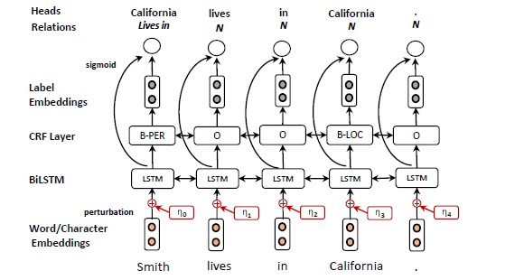

# Adversarial training for multi-context joint entity and relation extraction

>> Giannis Bekoulis, Johannes Deleu, Thomas Demeester, 2018, EMNLP

[Source code](https://github.com/bekou/multihead_joint_entity_relation_extraction) is available.

## Motivation

Szegedy et al. observed that intentional small scale perturbations (i.e., adversarial examples) to the input of such models may lead to incorrect decisions.

The core contribution of this paper is the use of AT as an extension in the training procedure for the joint extraction task.

## Methodology

### Joint learning as head selection

The baseline joint model aims to detect:
* the type and boundaries of the entities
* the relations between them

Our model for joint entity and relation extraction with adversarial training (AT) comprises (i) a word and character embedding layer, (ii) a BiLSTM layer, (iii) a CRF layer and (iv) a relation extraction layer. In AT, we compute the worst-case perturbations $\eta$ of the input embeddings

#### NER task

For the prediction of the entity tags, we use: (i) a softmax approach for the entity classification (EC) task (assuming entity boundaries given) or (ii) a CRF approach where we identify both the type and the boundaries for each entity.

#### Relation extraction task

The goal of the task is to predict for each word $w_i$, a vector of heads $\hat{y}_i$ and the vector of corresponding relations $\hat{r}_i$. We compute the score $s(w_j ,w_i, r_k)$ of word $w_j$ to be the head of $w_i$ given a relation label $r_k$ using a single layer neural network.

The corresponding probability is defined as: $\mathbb{P}(w_j,r_k|w_i;\theta)=\sigma(s(w_j,w_i,r_k))$. During training, we minimize the cross-entropy loss $\mathcal{L}_{rel}$ is:

$$
{L}_{rel} = \sum \limits_{i=0}^m \sum \limits_{j=0}^m -\log \mathbb{P}(y_{i,j},r_{i,j}|w_i;\theta)
$$

where $m$ is the number of associated heads (and thus relations) per word $w_i$.

### Adversarial training (AT)

We generate an adversarial example by adding the worst-case perturbation ηadv to the original embedding w that maximizes the loss function:

$$
\eta_{adv}=\mathop{\arg\max} \limits_{||\eta|| \leq \epsilon} \mathcal{L}_{JOINT} (w+\eta; \hat{\theta})
$$

where $\mathcal{L}_{JOINT} = \mathcal{L}_{NER} + \mathcal{L}_{rel}$, $\hat{\theta}$ is a copy of the current model parameters.

Since above equation is intractable in neural networks, we use the approximation proposed in Goodfellow et al. (2015) defined as:

$$
\eta_{adv} = \frac{\epsilon g}{||g||} \quad g = \nabla_w \mathcal{L}_{JOINT}(w;\hat{\theta})
$$

where $\epsilon$ is a small bounded norm treated as a hyperparameter. Similar to Yasunaga et al. (2018), we set $\epsilon$ to be $\alpha\sqrt{D}$ (where $D$ is the dimension of the embeddings). We training on the mixture of the original and adversarial examples, so the final loss is computed as: $\mathcal{L}_{JOINT}(w;\hat{\theta}) + \mathcal{L}_{JOINT}(w+\eta_{adv};\hat{\theta})$

## Dataset

* ACE 04
* CoNIL 04
* DREC
* ADE