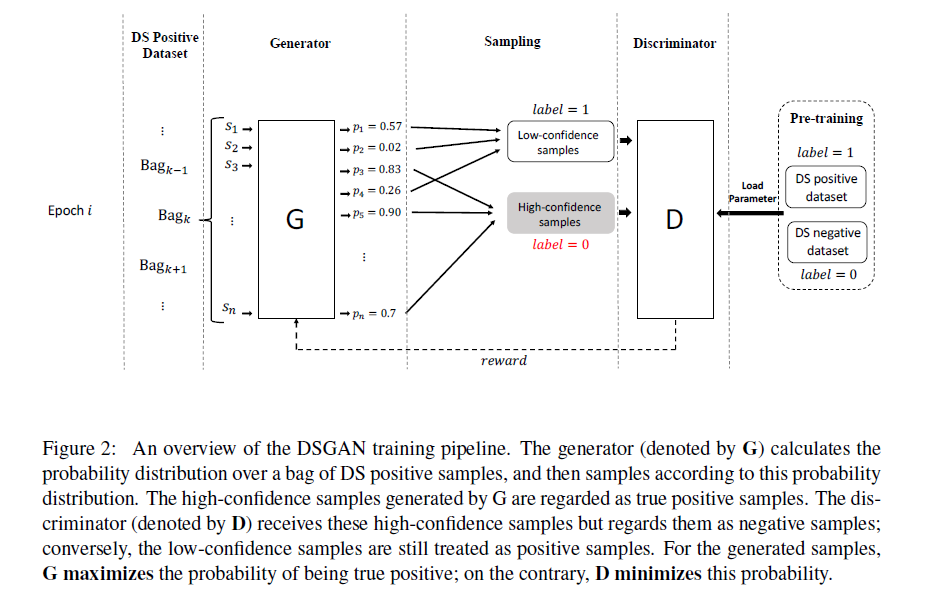
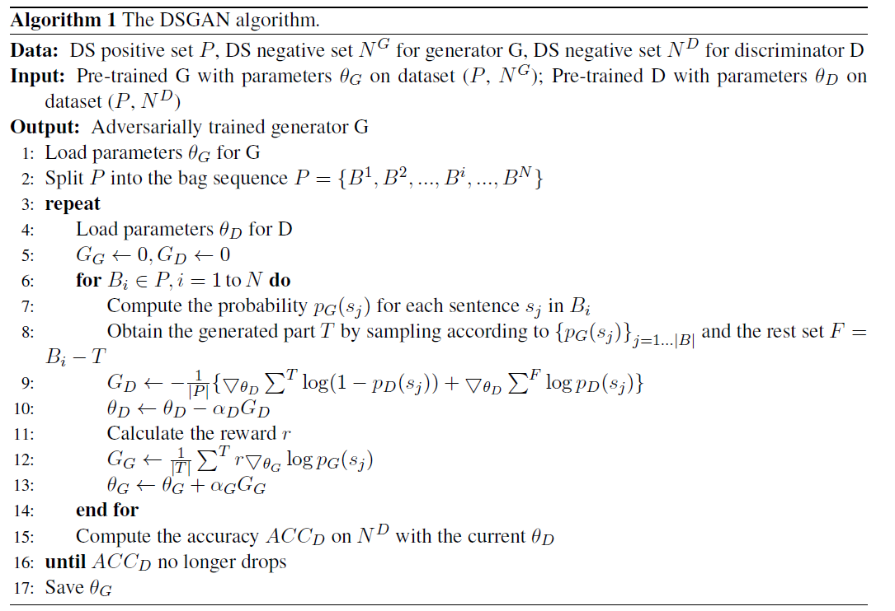

# DSGAN: Generative Adversarial Traning for Distant Supervision Relation Extraction

>> Pengda Qin, Weiran Xu, William Yang Wang, 2018, ACL

[Source code](https://github.com/Panda0406/Adversarial-Learning-Distant-Supervision-RE) is available.

# Motivation

Attention-based methods make the denoising operation in the sentence bag level and overlook the case that all sentences of an entity pair are false positive, which is also the common phenomenon in distant supervsion datasets. Under this consideration, an independent and accurate sentence-level noise reduction strategy is the better choice.

## Overview

Prerequisite: in terms of quantity, the true positive samples still occupy most of the proportions.

Given a set of distantly-labeled sentences, the generator tries to generate true positive samples from it; But, these generated samples are regarded as negative samples to train the discriminator. Thus, when finishing scanning the DS positive dataset one time, the more true positive samples that the generator discovers, the sharper drop of performance the discriminator obtains. After adversarial training, we hope to obtain a robust generator that is capable of forcing discriminator into maximumly losing its classification ability.

## Mehodology

### Pre-Training Strategy

Both the generator and the discriminator require the pre-training process, which is the common setting for GANs.

The discriminator is pre-trained with DS positive dataset $P$ (lable 1) and DS negative set $N^D$ (label 0)

The pre-training of generator is similar to the discriminator; however, for the negative dataset, we use another competely different dtaset $N^G$.

Specially, we let the generator overfits the DS positive dataset $P$. The reason of this is that we hope the generator wrongly give high probabilities to all of the noisy DS positive samples at the beginning of the training progress.

### Generative Adversarial Training for DS RE

The goal of the generator is to accurately recognize true positive samples. For a input sentence $s_j$, we define the probability of being true positive sample by generator as $P_G(s_j)$. Similarly, for discriminator, the probability of being true positive sample is denoted as $P_D(s_j)$. In order to obtain more feedbacks and make the training process more efficient, we split the DS $P = \{s_1,s_2,\cdots,s_j,\cdots\}$ into $N$ bags $B=\{B^1,B^2,\cdots,B^N\}$, and the network parameters $\theta_G, \theta_D$ are updated when finishing processing on bag $B^i$.

#### Generator

A set of sentence are sampled and we denote this set as $T$:

$$
T=\{s_j\}, s_j \sim p_G(s_j),\ j=1,2,\dots,|B_i|
$$

In order to challenge the discriminator, the objective of the generator can be formulated as **maximizing** the following probabilities of $T$:

$$
L_G = \sum \limits_{s_j \in T} \log p_D(s_j)
$$

Because $L_G$ involves a discrete sampling step, so we adopt the policy-gradient-based reinforcement learning method to update its parameters.

#### Discriminator

$T$ is treated as the negative samples; conversely, the rest part $F=B^i - T$ is treated as positive samples. So the objective of the discriminator can be formulated as **minimizing** the following cross-entropy loss function:

$$
L_D=-(\sum \limits_{s_j \in (B^i-T)} \log p_D(s_j) + \sum \limits_{s_j \in T)}\log(1-P_D(s_j)))
$$

Our discriminator loads the same pretrained parameter set at the beginning of each epoch. There are two reason:
* We need a robust generator rather than a discriminator
* Our generator is to sample data rather than generate new data from scratch

Therefore, the discriminator is relatively easy to be collapsed. The robustest generator is yielded when the discriminator has the largest drop of performance in one epoch.

### Optimizing Generator

The objective of the generator is similar to the objective of the one-step-reinforcement learning problem: Maximizing the parametrized probability distribution.

We defined the reward $r$ from two angles:
1. We hope the confidence of being positive samples by the discriminator becomes higher
   
   $$
   r_1 = \frac{1}{|T|}\sum \limits_{s_j\in T}P_D(s_j) - b_1
   $$

2. From the average prediction probability of $N^D$,
   
   $$
   \tilde{p} = \frac{1}{|N^D|}\sum \limits_{s_j\in N^D}P_D(s_j)
   $$

   When the classification capacity of discriminator declines, the accuracy of being predicted as negative sample on $N^D$ gradually drops; thus, $\tilde{p}$ increases. Therefore, for epoch $k$, after processing the bag $B^i$, reward $r_2$ is calculated as below:
   
   $$
   r_2 = \eta(\tilde{p}^k - b_2)
   $$

The gradient of $L_G$ can be formulated as below:

$$
\begin{aligned}
\nabla_{\theta_D}L_G &= \sum \limits_{s_j\in B^i} \mathbb{E}_{s_j \sim P_G(s_j)} r\nabla_{\theta_G} \log P_G(s_j) \\
& = \frac{1}{|T|}\sum \limits_{s_j\in T}r\nabla_{\theta_G} \log P_G(s_j)
\end{aligned}
$$

### Cleaning Noisy Dataset with Generator

After the adversarial learning process, we obtain one generator for one relation type. Thus, we can use the generator to filter the noise samples from dataset.

For an entity pair with a set of annotated sentences, if all of these sentences are determined as false negative by our generator, this entity pair will be redistributed into the negative set. Under this strategy, the scale of distant supervision training set keeps unchanged.