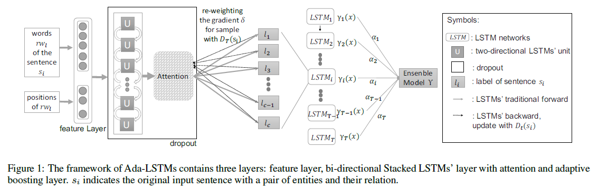
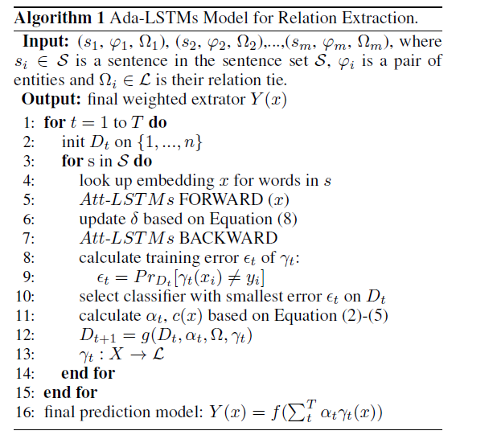

# Ensemble Neural Relation Extraction with Adaptive Boosting

>> Dongdong Yang, Senzhang Wang, Zhoujun Li, 2018, ENMLP

## Motivation

The main issue of existing deep models is that their performance may not be stable and could not effectively handle the quite imbalanced, noisy, and wrong labeled data in relation extraction even if a large number of parameters in the model.

## Overview

The model mainly consists of three layers: feature layer, bi-directional LSTMs layer with an attention and adaptive boosting layer. The feature layer makes sentence vectorized and embeds them as the input of the model. The bi-directional LSTMs with attention layer can deeply capture the latent information of each sentence. Attention mechanism could weight each phase in a sentence, which is learned during the training process. The adaptive boosting layer combines multiple classifiers to generate the final weighted joint function for classifying the relation.

## Methodology

### Embedding Features

The embedded features contain word embeddings and position embeddings. We use two embedded features for relation extraction as the input of the bi-directional long short-term memory neural networks.

### Multi-class Adaptive Boosting Neural Networks

$$
Y(x)=f(\sum_t^T \alpha_t \gamma_t(x))
$$

where $Y$ is the final prediciton model obtained by weighted voting, $\alpha_t$ means the weight of each classifier $\gamma_t(x)$. The result of training the $t^{th}$ classifier is such a hypothesis $h_t: X \rightarrow L$ where $X$ is the space of input features and $L=\{1,\dots,c\}$ is the space of labels.

$$
\alpha_t = \frac{1}{2}\ln \frac{1-\epsilon_t}{\epsilon_t}
$$

Our model assigns equal value for each batch in the dataset. Each batch contains the same number of sentences. The vector $D_1(b_i) = \frac{1}
{n}$, where $n$ is the number of batches, $b_i$
is the $i^{th}$ batch of all the samples. $D_1$ means the initialized
vector parameter in the first epoch.

$$
\epsilon = \sum_j e^{\tau_j}, \quad \tau < \frac{1}{2} \\
\tau_j = \frac{\sum_k^K \textnormal{error}(I(\gamma(k)\neq y_k))}{K}
$$

$\textnormal{error}(I(\gamma(k)\neq y_k))$ means that when the model output $\gamma(k)$ is not equal to its true label $y_k$ in a batch $b_i$, we gather the error of that batch. $I$ is the error indicator and $K$ is the batch size. Finally we average the error $\tau$ of each batch $j$ as above.

$$
c(x)=\begin{cases} e^{\alpha_t}, \quad \tau <\frac{1}{2} \\ e^{-\alpha_t}, \quad \tau \geq \frac{1}{2} \end{cases} \\
D_{t+1}(b_i) = \frac{D_t(b_i)}{Z_t}c(x)
$$

By combining above equations, we have the following equation:

$$
D_{t+1}(b_i) = \frac{D_t(b_i)}{Z_t}e^{-\alpha_t y_i \gamma_t(x_i)}
$$

The pseudocode of the Ada-LSTMs model is given in Algorithm 1. $m$ is the total number of training data. $n$ is the number of batches. $\epsilon_t$ is the training error of the training samples. $\delta_{old}$ is the final layer derivative in back propagation and $\delta_{new}$ is the new derivative in back propagation used to update the networks.  $\beta = \frac{1}{max(D_t)}$ is the reciprocal of maximal $D_t(b_i)$ value, where $i$ is the index of batch number and $s$ is a sentence in the corpus $\mathcal{S}$. $\beta$ is a coefficient, aiming at avoiding $D_t$ too small to update the NN. $g$ is a mapping function. $f$ is a softmax function. Att-LSTMs is the LSTMs with selective attention model, which will be described later.

#### LSTMs with Selective Attention (Att-LSTMs)

$$
\alpha_t = \frac{\exp(e_t)}{\sum_{t=1}^l\exp(e_t)}=\frac{\exp(f_a(h_t))}{\sum_{t=1}^l\exp(f_a(h_t))}
$$

$$
e_t = f_a(h_t) = \sigma(Wh_t + b)
$$

Then, we compute the sentence vector $c$ as a sum of adaptive weighted average of state sequence $h_t$.

#### Loss Function

$$
L_0 = -\sum_{k=1}^n\sum_{i=1}^C y_{ki} \log(q_{ki})
$$

where $n$ is the total number of samples, $C$ is the number of labels. $q = f(c)$ is the output of the softmax function.

## Dataset

NYT dataset via filtering part of NA negative data.