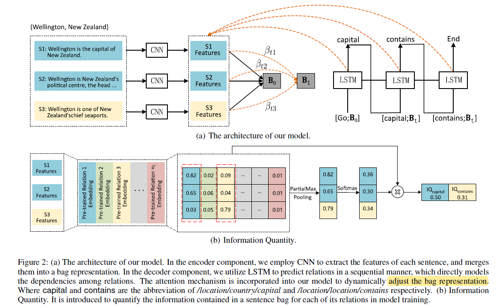

# Exploring Encoder-Decoder Model for Distant Supervised Relation Extraction

>> Sen Su, Ningning Jia, Xiang Cheng et al. 2018 IJCAI

## Motivation

The dependencies among relations of an entity pair are common, it benefical to consider relation dependencies while predicting the target relations of an entity pair.

## Model Architecture

Given an entity pair and its sentence bag as input, in the encoder component 
employs the CNN to extract the features and merge them into a bag 
representation. The decoder component employs the LSTM to model relation 
dependencies and predict the target relations in a sequential manner.

The relations having more information in the bag representation are predicted 
earlier and used as prior knowledge for further predictions.

The attention mechanism is additionally incorporated into our model to adjust
the context vector during decoding in order to highlight sentences whose 
corresponding relations have not been predicted. During training, a certain 
order of relations is determined for each sentence bag using our proposed 
measure of Information Quantity for relations in a sentence bag. During 
testing, we only accept a bag of sentences as input, let the model 
automatically learn Information Quantity of each target relation and predict 
them in descending orders of their amounts of information.

## Methodology

### Encoder

$$
\mathbf{x}_i=CNN(x_i); \quad \mathbf{B}=\phi(\{\mathbf{x}_i\})\quad i=1,2,\dots,n
$$

### Decoder

The predicted relation $y_t$ at time $t$ is computed by:

$$
\begin{aligned} 
& \mathbf{s}_t = LSTM(\mathbf{s}_{t-1}, y_{t-1}, \mathbf{B}) \\
& p(y_t=l_j|\{y_1,\cdots,y_{t-1}\}, \mathbf{B}) = \frac{\exp(l_j\mathbf{Ts}_t)}{\sum_{l_i \in L}\exp(l_i\mathbf{Ts}_t)}
\end{aligned}
$$

where $l_i$ is the $i$-th relation, $L$ is the relation Set, $\mathbf{T}$ is a transformation matrix and $\mathbf{s}_t$ is the hidden state of LSTM.

### Attention Mechanism

Pay more attention to those sentences whose corresponding relations have not been predicted.

$$
\begin{aligned}
\mathbf{B}_t &= \sum \limits_{i=1}^{n}\beta_{ti}\mathbf{x}_i \\
\beta_{ti} &=\frac{\exp(\eta(s_{t-1}, \mathbf{x}_i))}{\sum_{k=1}^n \exp(\eta(s_{t-1}, \mathbf{x}_i))}
\end{aligned}
$$

$\eta$ is a neural network. The score is based on the LSTM hidden state $\mathbf{s}_{t-1}$ and the $i$-th sentence embedding $\mathbf{x}_i$.

### Traning and Testing

For both traning and testing, the bag representation should be initialized before the first relation can be predicted.

#### Deterniming the Order of Relations

Information Quantity, which is used to quantify the information contained in a sentence bag for each of its relations, is calculated by the following two stages:

1. Compute the matching scores between each input sentences and each relation:
   
   $$
   \mathbf{W} = \mathbf{XM}
   $$

   where $\mathbf{X}\in \mathbb{R}^{n\times d^s}$ is the matrix of sentences embeddings, and $\mathbf{M}\in \mathbb{R}^{d^s \times n_l}$ is the representation matrix of pre-trained relations.
2. Define Partial Max-pooling method to compute the weight of each input sentence based on $\mathbf{W}$:
   
   $$
   e_i = \max (\mathbf{W}_{ij})\quad i=1,2,\dots,n,\ j\in L^+
   $$

   where $j\in L^+$ is the positive relation of the given sentence bag.

   The weight of each input sentence:
   
   $$
   \alpha_i = \frac{\exp{e_i}}{\sum_{k=1}^n \exp(e_i)}
   $$

   Given a bag and its relations:
   
   $$
   IQ_j=\sum \limits_{i=1}^n \alpha_i \mathbf{W}_{ij} \quad i=1,2,\dots,n,j\in L^+
   $$

   The same weights are used to calculate $IQ_j$.

We adopt the descending order of relation frequency to pre-train relation embedding in relation extraction

#### Initializing Bag Representation

Two methods are used to initialize the bag representation. One is average method, the other is Paitial Max-pooling method as above formulation.

#### Loss Function

$$
\mathcal{L}_{squared}=\sum\limits_{t=1}^{n_B}\sum\limits_{i=1}^{n_l}(q_{ti}-p_{ti})^2
$$

where $n_B$ is the number of relations corresponding to a sentence bag, $n_l$ is the number of all relations. $q_{ti} \in \{0,1\}$ is the true value on relation $i$ at time $t$, $p_{t_i}$ is the predicted probability of the $i$-th relation at time $t$.

A special symbol \<End> at the end of the relations of each sentence bag in the traning phase.