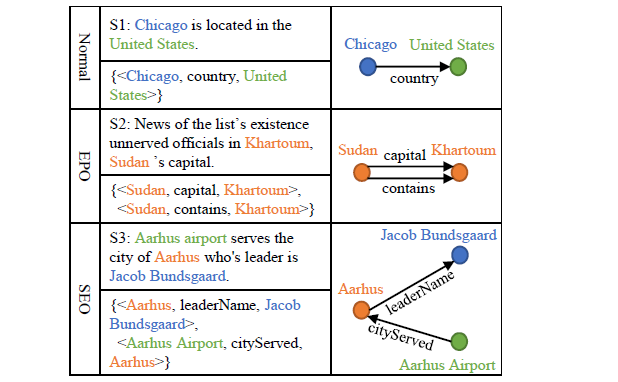
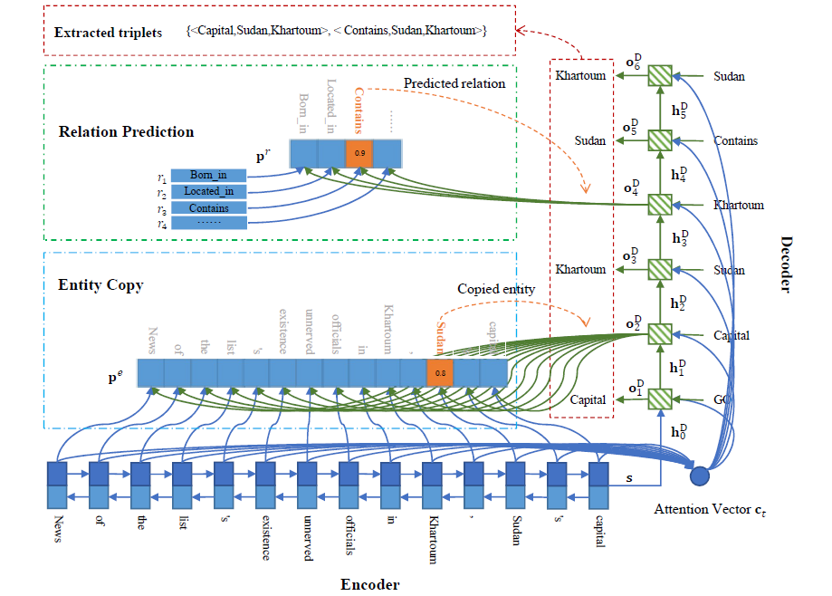
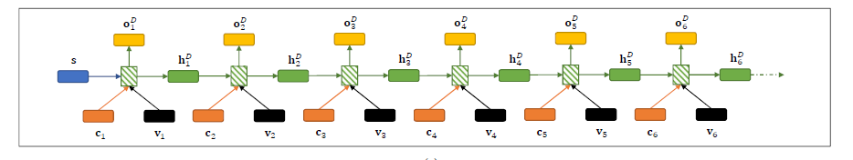
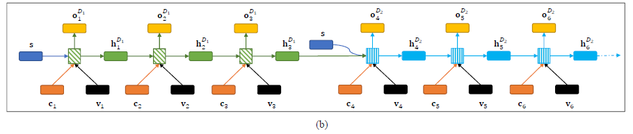

# Extracting Relational Facts by an End-to-End Neural Model with Copy Mechanism

>> Xiangrong Zeng, Daojian Zeng, Shizhu He et al, 2018, ACL

[Source Code](https://github.com/xiangrongzeng/copy_re) is available.

## Motivation

Different relational triplets may have overlaps in a sentence. We divided the sentences into three types according the triplet overlap degree, including Normal, EntityPairOverlap and SingleEntityOverlap. 

Existing models mainly focus on Normal class and fail to extract relational triplets precisely.

## Overview

Main contributions:
* We propose an end2end neural model based on sequence-to-sequence learning with copy mechanism to extract relational facts from sentences, where the entities and relations could be jointly extracted.
* Our model could consider the relational triplet overlap problem through copy mechanism. In our knowledge, the relational triplet overlap problem has never been addressed before.
* We conduct experiments on two public datasets. Experimental results show that we outperforms the state-of-the-arts with 39.8% and 31.1% improvements respectively.

## Methodology

Our model encodes a variable-length sentence into a fixed-length vector representation first and then decodes this vector into the corresponding relational facts (triplets). When decoding, we can either decode all triplets with one unified decoder or decode every triplet with a separated decoder. We denote them as OneDecoder model and MultiDecoder model separately.

### OneDecoder Model

#### Encoder

We use bi-directional RNN  to encode the input sentence. the concatenation of forward and backward RNN hidden states are used as the representation of sentence, that is:

$$
\mathbf{s} = [\overrightarrow{h}^E_n;\overleftarrow{h}^E_n]
$$

#### Decoder

The decoder is used to generate triplets directly. Firstly, the decoder generates a relation for the triplet. Secondly, the decoder copies an entity from the source sentence as the first entity of the triplet. Lastly, the decoder copies the second entity from the source sentence. Repeat this process, the decoder could generate multiple triplets. Once all valid triplets are generated, the decoder will generate NA triplets, which means “stopping” and is similar to the “eos” symbol in neural sentence generation. Note that, a NA triplet is composed of an NA-relation and an NA-entity pair.

In step $t$, we calculate the decoder output $o_t^D$ and hidden state $h_t^D$ as follows:

$$
o_t^D, h_t^D=g(u_t, h_{t-1}^D)
$$

where we initalize $h_0^D$ with the representation of $s$. $u_t$ is the decoder input in step $t$ ans we calculate it as:

$$
u_t=[v_t;c_t]\cdot W^u
$$

where $c_t$ is the attention vector and $v_t$ is the embedding of copied entity or predictied relation in step $t-1$.

##### Attention Vector

$$
\begin{aligned}
c_t &= \sum_{i=1}^n \alpha_i \times o_i^E \\
\alpha &= \textnormal{softmax}(\beta) \\
\beta &= \textnormal{selu}([h_{t-1}^D;o_i^E]\cdot W^c)
\end{aligned}
$$

where $o_i^E$ is the output of encoder in time step $i$.

After we get decoder output $o^D_t$ in time step $t (1 \le t)$, if $t\%3 = 1$ (that is $t = 1,4,7,\dots$), we use $o^D_t$ to predict a relation, which means we are decoding a new triplet. Otherwise, if $t\%3 = 2$ (that is $t = 2,5, 8,\dots$), we use $o^D_t$ to copy the first entity from the source sentence, and if $t\%3 = 0$ (that is $t = 3,6,9,\dots$), we copy the second entity.

##### Predict Relation

We use a fully connected layer to calculate the confidence vector $q^r=[q_1^r,\dots,q_m^r]$ of all valid relations

$$
q^r = \textnormal{selu}(o_t^D\cdot W^r + b^r)
$$

We calculate the confidence f the NA-relation as:

$$
q^{NA} = \textnormal{selu}(o_t^D\cdot W^{NA} + b^{NA})
$$

We obtain the probability distribution as:

$$
p^r = \textnormal{softmax}([q^r;q^{NA}])
$$

We select the relation with highest probability as the predict relation and use it's embedding ($o^D_t$) as the next time step input $v_{t+1}$.

##### Copy the First Entity

The confidence vector $q^e = [q_1^e, \dots,q^e_n]$ of all words in source sentence:

$$
q_i^e = \textnormal{selu}([o^D_t;o_i^E]\cdot W^e)
$$

The probability distribution is:

$$
p^e = \textnormal{softmax}([q^e;q^{NA}])
$$

Similarly, we select the word with the highest probability as the entity and use its embedding as the next time step input $v_{t+1}$.

##### Copy the Second Entity

The only difference from the first entity is that when copying the second entity, we cannot copy the first entity again.

We introduce a mask $M$ with $n$ elements, where:

$$
M_i = \begin{cases} 1, i \neq k \\ 0, i = k \end{cases}
$$

then we calculate the probability distribution $p^e$ as:

$$
p^e = \textnormal{softmax}([M \otimes q^e; q^{NA}])
$$

where $\otimes$ is element-wise multiplication.

### MultiDecoder Model

Decoders work in a sequential order: the first decoder generate the first triplet and then the second decoder generate the second triplet.

$$
o^D_t, h_t^D=\begin{cases} g^{D_i}(u_t, h_{t-1}^{D_i}) \quad \text{when decode entity} \\ g^{D_i}(u_t, \hat{h}_{t-1}^{D_i}) \quad \text{when decode relation} \end{cases}
$$

where $h_{t-1}^{D_i}$ is the hidden state of $i$-th decoder in time step $t-1$. $\hat{h}^{D_i}_{t-1}$ is the initial hidden state of $i$-th decoder, which is calculated as follows:

$$
\hat{h}^{D_i}_{t-1}=\begin{cases} s, \quad &i=1 \\ \frac{1}{2}(s + h_{t-1}^{D_{i-1}}) \quad &i > 1 \end{cases}
$$

### Training

Give a batch of data with $B$ sentences $S=\{s_1,\dots,s_B\}$ with the target results $Y=\{y_1,\dots,y_B\}$, where $y_i=[y_i^1,\dots,y_i^T]$ is the target of $s_i$, the loss function is:

$$
\mathcal{L} = \frac{1}{B\times T}\sum_{i=1}^B\sum_{t=1}^T-\log(p(y_i^t|y_i^{<t},s_i,\theta))
$$

where $T$ is the maximum time step of decoder.

## Dataset

1. New York Times (NYT)
   * 24 valid relations in total
   * 56195 setences as training set
   * 5000 sentences as testing set
   * 5000 sentences as validation set
2. WebNLG
   * 246 valid relations
   * Created for Natural Language Generation task