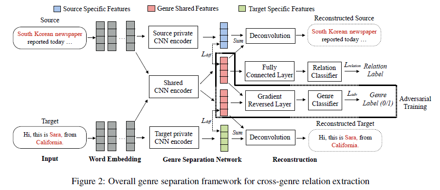

# Genre Separation Network with Adversarial Training for Cross-genre Relation Extraction

>> Ge shi, Chong Feng, Lifu Huang, 2018, EMNLP

## Motivation

Relation Extraction suffers from dramatical performance decrease when training a model on one genre and directly applying it to a new genre, due to the distinct feature distributions.

To effectively automate this process, we design a genre-separation network, which applies two encoders, one genreindependent and one genre-shared, to explicitly extract genre-specific and genre-agnostic features.

## Overview

We propose a genreseparation network, which consists of two separate Convolutional Neural Networks (CNNs) to automatically separates genre-specific and genreagnostic features for each genre, which is depicted as Genre Separation Network. To avoid information loss during feature encoding, we reconstruct the original input from the two separate feature spaces via a novel reconstruction loss. Then we use an adversarial similarity loss to limit the genre-agnostic features into one feature space. The genre-agnostic features are finally used to predict entity relations in the source and target genres.

## Methodology

### Genre Separation Network (GSN)

We apply a source private CNN encoder on the source sentence to generate the source-specific feature representation $f^p_s$ , and a shared CNN encoder to generate genre-agnostic feature $f^c_s$ . Similarly, we get $f^p_t$ and $f^c_t$ from the target private CNN encoder and the shared CNN encoder respectively.

To separate $f_s^p$ from $f_s^c$ and separate $f_t^p$ and $f_t^c$, we introduce a difference loss:

$$
L_{diff}=||{f_s^p}^T\cdot f_s^c + {f_t^p}^T \cdot f_t^c||_2^F
$$

To limit the genre-agnostic features from various genres into a shared feature space, we further design a genre adversarial training component. We take the genre-agnostic features from both source genre and target genre as input to a Gradient Reversed Layer(GRL) (Ganin et al., 2016), which acts as a general hidden layer in forward process and reverses the gradient in loss backward phase to confuse the genre classifier, so that it cannot distinguish the input features from the source genre to the target genre:

$$
L_{adv} = \sum \limits_{i=0}^{N_s+N_t} d_i\log(\hat{d}_i) + (1-d_i)\log(1-\hat{d}_i)
$$

where $d\in \{0,1\}$ indicates the samples from the source genre or the target genre, and $N_s, N_t$ refer to the number of examples in the source genre and the target genre respectively.

### Genre Reconstruction

There is no guarantee that the separated feature spaces are actually meaningful. From equation $L_{diff}$ , we can see that the $f^p_s$, $f^p_t$ would be easily optimized to zero if we did not place a constraint, in which case the model would fail to train.

We take $f_s = f_s^p + f_s^c$ as input to an unpooling layer followd by a de-convolutional neural network (DcNN). We optimize the DcNN with the following reconstrction loss:

$$
L_{rec} = 1 - \sum \limits_{i=0}^n|cos(\tilde{v_i}, \tilde{v_i^{*}})|
$$

where $n$ indicates the total number of words int the sentence, $\tilde{v_i}$ represetns the input word representation, and $\tilde{v_i^{*}}$ is the corresponding reconstructed vector from DcNN.

### Cross Genre Relation Extraction

We next utilize the genre-agnostic features from the source genre $f^c_s$ to train a relation classifier

$$
L_{relation} = \sum\limits_{i=0}^{N_s} \sum \limits_{k=0}^K-x_k\log(x_k)
$$

We finally linearly combine all the loss function and jointly optimize the model using SGD:

$$
L=L_{relation} + \alpha L_{diff} + \beta L_{rec} + \gamma L_{adv}
$$

## Dataset

English portion of ACE2005 dataset.