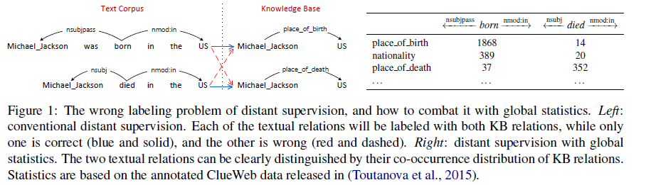
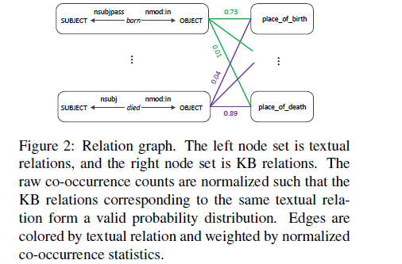
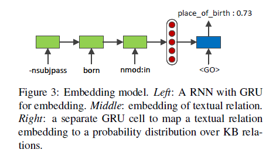

# Global Relation Embedding for Relation Extraction

>> Yu Su, Honglei Liu, Semih Yavuz, 2018, NAACL

>> [Source Code](https://github.com/ppuliu/GloRE) is available.

## Motivation

Textual relations are one of the most discriminative textual signals that lay the foundation of many relation extraction models.

Traditional embedding methods are based on local statistics, i.e., individual textual-KB relation pairs like in Figure 1 (Left). Our key hypothesis is that global statistics is more robust to noise than local statistics.

## Overview

In this work, we study the problem of embedding textual relations, defined as the shortest dependency path between two entities in the dependency graph of a sentence, to improve relation extraction.

For the modeling part, we first describe how to collect global co-occurrence statistics of relations, then introduce a neural network based embedding model, and finally discuss how to combine the learned textual relation embedding with existing relation extraction models.

## Methodology

### Global Statistics of Relations

When using a corpus to train statistical models, there are two levels of statistics to exploit: local and global. Most existing studies on relation extraction are based on local statistics of relations, i.e., models are trained on individual relation examples.

In this section, we describe how we collect global cooccurrence statistics of textual and KB relations, and how to normalize the raw statistics. By the end of this section a bipartite relation graph like Figure 2 will be constructed, with one node set being textual relations T , and the other being KB relations R. The edges are weighted by the normalized co-occurrence statistics of relations.

#### Relation Graph Construction

The number of co-occurrences of a textural relation $t_i$ and a KB relation $r_j$ is

$$
n_{ij}=\sum_{(e,e^{'})\in S(r_j)} m_{S(t_i)} (e, e^{'})
$$

where $t_i$ is the fully lexicalized shorted dependency path between $(e, e^{'})$, $S(t_i)$ is the support of $t_i$ containing the multiplicity entity pairs of the textual relation, $m_{S(t_i)} (e, e^{'})$ is the number of occurrences of the corresponding relational fact $(e, t_i, e^{'})$ in the corpus.

#### Normalization

Learning directly on the raw co-occurrence counts, an embedding model may put a disproportionate amount of weight on the most frequent relations, and may not learn well on the majority of rarer relations.

We have experimented with a number of normalization strategies and found that the following strategy works best for textual relation embedding: For each textual relation, we normalize its co-occurrence counts to form a probability distribution over KB relations.

The new edge weights of the relation graph thus become $w_{ij}=\tilde{p}(r_j|t_i)=n_{ij}/\sum_{j^{'}}n_{ij^{'}}$.

### Textual Relation Embedding

#### Embedding via RNN

Textual relations are different from words in that they are sequences composed of words and typed dependency relations.

Note that we include directional dependency relations, because both the relation type and the direction are critical in determining the meaning of a textual relation.

$$
h_l = GRU(\phi(x_l), h_{l-1})
$$

where $\phi$ denote the functin that maps a token $x_l$ to a fixed-dimensional vector.

#### Training Objective

Specifically, we model the semantics of a textual relation as its co-occurrence distribution of KB relations, and learn textual relation embedding to reconstruct the cor responding co-occurrence distributions.

$$
p(r_j|t_i) = \text{softmax}(GRU(\phi(<GO>), h_m))_j
$$

where $()_j$ denotes the $j$-th element of a vector, and \<GO> is a special token indicating the start of decoding. The training objective is to minimize

$$
\Theta = \frac{1}{|\mathcal{E}|}\sum_{i,j:\tilde{p}(r_j|t_i)>0}(\log p(r_j|t_i) - \log \tilde{p}(r_j|t_i))^2
$$

where $\mathcal{E}$ is the edge set of the relation graph.

### Augmenting Relation Extraction

More formally, for each entity pair $(e, e^{'})$ and a set of contextual sentences $C$ containing this entity pair, a relation extraction model assigns a score $E(z|C)$ to each candidate relational fact $z = (e, r, e^{'})$, $r \in \mathcal{R}$. On the other hand, our our textual relation embedding model works on the sentence level. It assign a score $G(z|s)$ to each contextual sentence $s$ in $C$ as for how well the textual relation $t$ between the entity pair in the sentence matches the KB relation $r$. It poses a challenge to aggregate the sentence-level scores $G(z|s)$ to get a set-level score $G(z|C)$.

We use summation with a trainable $cap$:

$$
G(z|C) = \min (cap, \sum_{s\in C}G(z|s))
$$

We simply use a weighted sum to combine $E(z|C)$ and $G(z|C)$:

$$
\tilde{E}(z|C) = w_1 E(z|C) + w_2 G(z|C)
$$

To find the optimal values for $w_1, w_2, cap$, we define a hinge loss:

$$
\Theta_{Merge}=\frac{1}{K}\sum_{k=1}^K\max (0, 1+\tilde{E}(z_k^-)-\tilde{E}(z_k^+))
$$

where $\{z_k^+\}_{k=1}^K$ are the true relational facts from the KB, and $\{z_k^-\}_{k=1}^K$ are false relational facts generated by replacing the KB relatin in true relational facts with incorrect KB relations.

## Dataset

NYT dataset