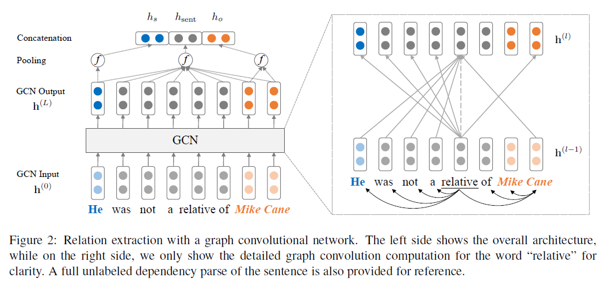

# Graph Convolution over Pruned Dependency Trees Improves Relation Extraction

>> Yuhao Zhang, Peng Qi, Chistopher D.Maning, 2018, EMNLP

[Source code](https://github.com/qipeng/gcn-over-pruned-trees) is available.

## Motivation

Existing dependency-based models either neglect crucial information by pruning the dependency trees too aggressively, or are computationally inefficient because it is difficult to parallelize over different tree structures.

## Contricutions

1. Propose a neural model for relation extraction based on graph convolutional networks, which allows it to efficiently pool information over arbitrary dependency structures.
2. Present a new path-centric pruning technique to help dependency-based models maximally remove irrelevant information without damaging crucial content to improve their robustness.
3. Show that dependency-based models have complementaty strengths with sequence models.

## Methodology

### Graph Convolutional Networks over Dependency Trees

A graph convolution operation can be written as:
$$
h_i^{l} = \sigma(\sum\limits_{j=1}^n A_{ij}W^{(l)}h_j^{(l-1)}+b^{(l)})
$$
Where $A$ is the adjacency matrix ($A_{ij}=1$ if there is an edge). During each graph convolution, each node gathers and summarizes information from its neighboring nodes in the graph.

Since the degree of a token varies a lot, it could bias the sentence representaion towards favoring high-degree nodes regardless of the information carried in the node. Furthermore, the information in $h_i^{(l-1)}$ is never carried over to $h^{(l)}_i$, since nodes never connect to themselves in a dependency tree. We resolve these issues by normalizing the activations in the graph convolution before feeding it through the nonlinearity, and adding self-loops to each node in the graph:
$$
h_i^{l} = \sigma(\sum\limits_{j=1}^n \tilde{A}_{ij}W^{(l)}h_j^{(l-1)}/d_i+b^{(l)})
$$
where $\tilde{A}=A+I$ and $d_i=\sum_{j=1}^n \tilde{A}_{ij}$.

We found that modeling directions does not lead to improvement, and adding edge-wise gating further hurts performance.

### Encoding Relations with GCN

$$
h_{sent} = f(h^{(L)}) = f(GCN(h^{(0)}))
$$
where $f:\mathbb{R}^{d\times n}\rightarrow \mathbb{R}^d$ is a max pooling function.

Information close to entity tokens in the dependency tree is central. There we obtain a subject representation $h_s$ from $h^{(L)}$ as follows:
$$
h_s=f(h_{s1:s2}^{(L)})
$$
where $s1$ and $s2$ are two spans of subject entity. object representaion $h_o$ is obtained similarly.

We obtain the final representation used for classification by concatenating the sentence and the entity representations, and feeding them througth a feed-forward neural network:
$$
h_{final}=FFNN([h_{sent};h_s;h_o])
$$
This $h_{final}$ representation is the fed into a linear layer followed by a softmax operation to obtain a probability distribution over relations.

### Contextualized GCN (C-GCN)

First, the input word vectors do not contain contextual information about word order or disambiguation. Second, the GCN highly depends on a correct parse tree to extract crucial informaiton from the sentence (especially when pruning is performed).

To resolve these issues, the input word vectors are first fed into a BiLSTM to generate contextualized representation, which are then used as $h^{(0)}$ in the original model.

This BiLSTM contextualization layer is trained jointly with the rest of the network

### Incorporating Off-path Information with Path-centric Pruning

Most information pertinent to relations is usually contained within the subtree rooted at the lowest common ancestor (LCA) of the two entities.

However, pruning too aggressively (e.g., keeping only the dependency path) could lead to loss of crucial information and conversely hurt robustness.

We propose path-centric pruning method, which is achieved by including tokens that are up to distance $K$ away from the dependency path in the LCA subtree.

We combine this pruning strategy with our GCN model, by directly feeding the pruned trees into the graph convolutional layers. For C-GCN model, the LSTM layer still operates on the full sentence regardless of the pruning.

We show that pruning with $K = 1$ achieves the best balance between including relevant information (e.g., negation and conjunction) and keeping irrelevant content out of the resulting pruned tree as much as possible