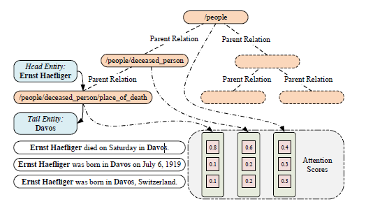
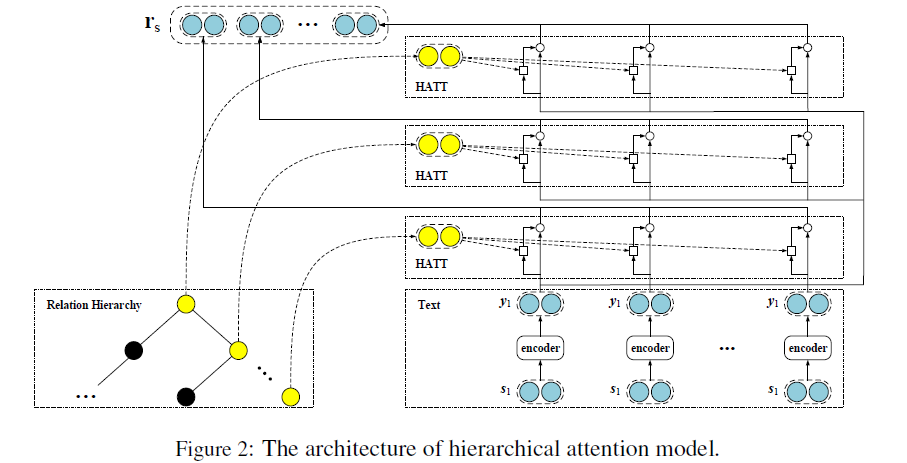

# Hierarchical Relation Extraction with Coarse-to-Fine Grained Attention

>> Xu Han, Pengfei Yu, Zhiyuan Liu et al, 2018, EMNLP

[Source code](https://github.com/thunlp/HNRE) is available.

## Motivation

Most existing methods handle each relation in isolation, regardless of rich semantic correlations located in relatio hierarchical.

## Overview

The multiple layers of our hierarchical attention schema provide coarse-to-fine granularity to better identify valid instances, which is especially effective for extracting those long-tail relations.

Our hierarchical attention schema follows the realtion hierarchical to compute scores for those instances comtaining the same entity pair on the each layer of the hierarchicals.

The attention on the bottom layer can capture more specific features of the relation, and the attention on the top-layer can capture the common features shared by several related sub-relations.

## Methodology

### Framework

The overall frame work of our models includes a sentence encoder and a coarse-to-fine grained hierarchical attention. The sentence encoder adopts several convolutional neural networks to represent sentence semantics with embeddings, and the hierarchical attention is used to select the most informative instances to exactly express their relations.

### Hierarchical Selective Attention

The inherent hierarchical structure of relations lead us to modeling hierarchical attention. The generation process can be done recursively. In practice, we start from $\mathcal{R}^0 = \mathcal{R}$ which is the set of all relations we focus for RE, and generate $k-1$ times to get a total of $k$-level hierarchical relation sets $\{\mathcal{R}^0,\dots,\mathcal{R}^{k-1}\}$

For a relation $r=r^0 \in \mathcal{R}^0$, which is the focus for RE, we construct its hierarchical chain of parent relation by backtracking the relation hierarchy as follow:

$$
(r^0,\dots,r^{k-1}) \in \mathcal{R}^0 \times \dots \times \mathcal{R}^{k-1}
$$

where $r^{i-1}$ is the sub-relation of $r_i$.

With the hierarchical chain, we compute attention operations on the each layer of the relation hierarchies to obtain corresponding textual relation representation,

$$
r_{h,t}^i = ATT(q_{r^i},\{s_1,s_2,\cdots,s_m\})
$$

where $q_{r^i}$ is a query vector, $s_i$ is an instance of the bag.

During the training process, those relation query vectors of high-level relations (i.e., $q_{r^i}$ with larger $i$) have more instances for training than those query vectors of base-level relation. Hence, the high-level query vectors are more robust for instance selection but with coarse-grained capability. In constrast, the base-level query vectors (i.e., $q_{r^i}$ with smaller $i$) always suffer from data sparsity, especially for those long-tail base relations. Hence, the base-level query vectors can perform fine-grained instance selection but the performance is no stable.

Based on the hierarchical selective attention, we can simply concatenate the textual relation representations on different layers as the final representation,

$$
r_{h,t}=[r^0_{h,t};\dots;r_{h,t}^{k-1}]
$$

The representation $r_{h,t}$ will be finally fed to compute the conditional probabilities of relations.