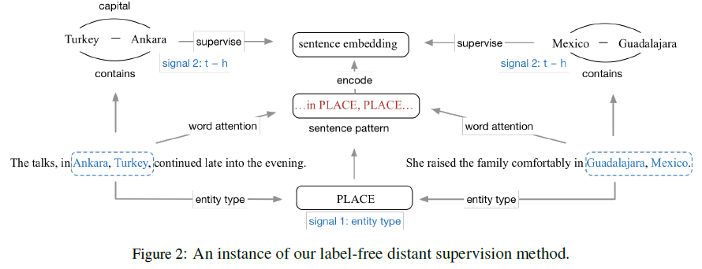
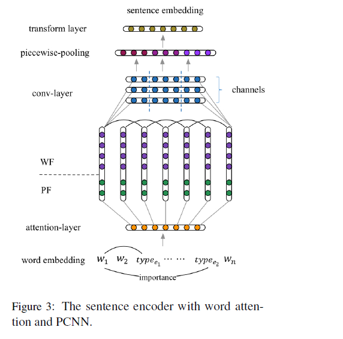
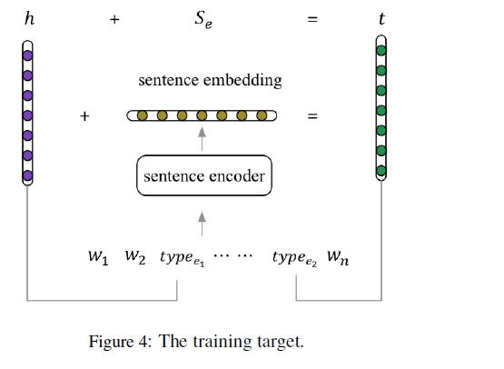

# Label-Free Distant Supervision for Relation Extraction via Knowledge Graph Embedding

>> Guanying Wang, Wen Zhang, Ruoxu Wang, Yalin Zhou, 2018, EMNLP

## Motivation

Previous works have tried different ways to address the noise problem. However, stacking extra model does not fundamentally solve the problem of inadequate supervision signals of distant supervision, and will introduce expensive training costs. Besides, they still used the hard relation label derived from distant supervision, which also brought in much noise.

This paper proposes a label-free distant supervision method, which makes no use of the relation labels under this inadequate assumption, but only uses the prior knowledge derived from the KG to supervise the learning of the classifier directly and softly.

## Overview

Here we present LFDS (Label-Free Distant Supervision) that essentially avoids noisy labels introduced by traditional distant supervision. 

* First, we pre-train representations for entities and relations based on the translation law $h + r \approx t$ defined by typical KG embedding models such as TransE.

* Second, for each sentence in the train sets, we replace the entity mentions with the types of the entities in the KG. An attention mechanism is then applied to calculate the importance of words with regard to the sentence pattern. 
  
* Third, we train the sentence encoder by the margin loss between $t−h$ and sentence embedding. Note we do not use the noisy relation labels to train the model. 
  
* Finally, for prediction, we calculate the embedding of test sentences, then compare the sentence embedding with all relation embeddings learned by TransE, and choose the closest relation as our predicted result.

## Methodology

### KG Embedding

Our work chooses TransE instead of other KG embedding models because TransE builds representations for $h$ and $t$ independent from fixed relation type $r$ as the model assumes we do not know the specific relation $r$ when training the encoder with supervision from $t − h$.

### Sentence Embedding

We chose PCNN to encode the sentence finally, which performs the best in our experiments. The encoder contains three parts as below.

We first replace the entity mentions $e$ in the sentences with corresponding entity types $type_e$ in the KG and we assume the words close to the types information are more important.

The similarity between each word $w_j$ and two entity types is calculated as:

$$
A_1^j = f(type_{e1}, w^j) \quad A_2^j = f(type_{e2}, w^j)
$$

where $f$ is defined as cosine similarity in this paper. We use the average weights of two entities as the attention of word $w_j$.

The structure of whole encoder is shown in above figure.

### Margin Loss

In order to make the sentence embedding encoded by the PCNN model and relation embedding specified by $t−h$ based on the translation law as close as possible, we use margin loss with linear layer instead of cross-entropy loss with softmax layer. 

For the sentence embedding via PCNN layer, we perform a linear transformation to make its dimension equal to the relation representation.

$$
s_e = \mathbb{W} \cdot PCNN(x) + \mathbb{b}
$$

The we define margin loss between $t-h$ and $s_e$ as follows:

$$
L = \sum \limits_{s_e\in S}[(t-h-s_e+\gamma-(rand(t^{'}-h, t-h^{'})-s_e))]_{+}
$$

Another point to note is the special label NA in the dataset, which means there is no relationship between the two entities in the KG. In this case, $t − h$ is pointless and will confuse our encoder. To deal with this issue, we generate a fixed relation for NA, used as the negative relation for those sentences having some relationships. The minimum distance from NA to other relations is forced to be greater than $2\gamma$, where $\gamma$ is the margin in loss function. When the model is used for prediction, the NA is also included.

The training target of our model is shown as below figure, including the sentence encoder we introduced above.

### Prediction

For a new test sentence, we first encode it with the model, then calculate the similarity between the sentence embedding and the embeddings of all candidate relations. The most similar relation to the sentence embedding is the predicted category.

$$
r = \arg \max_{i}(f(S_e, r_i))
$$