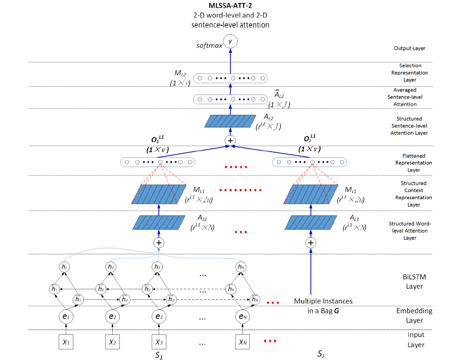

# Multi-Level Structured Self-Attention for Distantly Supervised Relation Extraction

>> Jinhua Du, Jingguang Han, Andy Way et al, 2018, EMNLP

>> Recommended paper: "A Structured Self-attentive Sentence Embedding"

## Motivation

There are two important representation learning problems in DNN-based DS-RE:
1. Entity pair-targeted context representation learning from an instance
2. Valid instance selection representation learning over multiple instances

The deficiency of the 1-$D$ attention vector is that it only focuses on one or a small number of aspects of the sentence, or one or a small number of instances.

## Overview

The proposed framework consists of three parts as shown above.
1. Including the input layer, embedding layer and BiLSTM layer
2. Entity pair-targeted context representation learning:
   * a structured word-level self-attention layer
   * a structured context representation layer
   * a flattened representation layer
3. The instance selection representation learning:
   * a structured sentence-level attention model
   * an averaged sentence-level attention layer
   * a selection representation layer
   * an output layer

## Methodology

### Structured Word-Level Self-Attention and its Penalisation Function

Given a bag $\mathcal{G} = \{S_1,S_2,\cdots,S_J\}$, $S_j$ can be represented using a sequence of word embeddings, as:
$$
S_j = (e_1, e_2, \cdots, e_N)
$$ 
The hidden state of the BiLSTM is denoted as:
$$
H = (h_1, h_2, \cdots, h_N)^T
$$
where $h_t$ is a concatenation of the forward hidden state $\overrightarrow{h}$ and the backward hidden state $\overleftarrow{h}$ at time step $t$. If the size of each unidirectional LSTM is $u$, then $H \in \mathbb{R}^{2u \times N}$.

Then, the structured word-level self-attention mechanism is defined as:
$$
A_{L1} = \textnormal{softmax}(W_{s2}^{L1}\tanh(W_{s1}^{L1}H))
$$
where $W_{s1}^{L1} \in \mathbb{R}^{d_a^{L1}\times 2u}$ is a weight matrix, $d_{a}^{L1}$ is a hyper-parameter. $W_{s2}^{L1} \in \mathbb{R}^{r^{L1} \times d_a^{L1}}$ is a weight matrix, $r^{L1} > 1$ is a hyper-parameter. $A_{L1} \in \mathbb{R}^{r^{L1} \times N}$ is the anotation matrix.

The size of $r^{L1}$ is defined based on how many different aspects of the sentences need to be focused on.

The resulting structured sentence representation $M_{L1}$ is:
$$
M_{L1} = A_{L1}H^T
$$
where $M_{L1} \in \mathbb{R}^{r^{L1} \times 2u}$

Subsequently, the output of the flattened representation layer for the instance $S_j$ in $\mathcal{G}$ is:
$$
O_j^{L1} = ReLU(W_o^{L1}M_{L1}^{FT} + b_o^{L1})
$$
where $M_o^{L1} \in \mathbb{R}^{v \times (r^{L1} \times 2u)}$, $M_{L1}^{FT} \in \mathbb{R}^{(r^{L1}\times 2u)\times 1}$ is the flattened strctured sentence representation which is a concatenated vector of each row in $M_{L1}$. $O_j^{L1}$ is the aggregated sentence representation of the $j$-th instance in the bag $\mathcal{G}$ with size $v$.

Then, the output of all instances in $\mathcal{G}$ is denoted as:
$$
O^{L1} = (O_1^{L1}, O_2^{L1},\cdots, O_J^{L1})^T
$$
where $O^{L1} \in \mathbb{R}^{v \times J}$.

The penalisation term for the structured word-level attention is as:
$$
P_{L1} = ||(A_{L1}A_{L1}^T - I)||_F^2
$$
Minimising this penalisation term means that we learn an orthogonal matrix for $A_{L1}$ so that each row in it only focuses on a single aspect of semantics.

### Structured Sentence-Level Self-Attention and Averaged Selection Representation

The Annotation matrix $A_{L2}$ is calculated as:
$$
A_{L2} = \textnormal{softmax}(W_{s2}^{L2}\tanh(W_{s1}^{L2}O^{L1}))
$$
where $W_{s1}^{L2} \in \mathbb{R}^{d_a^{L2}\times v}$, $W_{s2}^{L2} \in \mathbb{R}^{r^{L2} \times d_a^{L2}}$, $A_{L2} \in \mathbb{R}^{r^{L2} \times J}$.

Then, we averrage the 2-$D$ $A_{L2}$ to a 1-$D$ vector $\overline{A}_{L2} \in \mathbb{R}^{J}$.

Accordingly, we calculate the averaged weighted sum by multiplying $\overline{A}_{L2}$ and the aggregated sentence representation $O^{L1}$, with the resulting instance selection representation being:
$$
M_{L2} = \overline{A}_{L2} \cdot (O^{L1})^T
$$
where $M_{L2} \in \mathbb{R}^{v}$.

The probability distribution of the predicted relation type:
$$
p(\hat{y}|\mathcal{G}) = \textnormal{softmax}(W_o^{L2}\tanh(M_{L2}) + b_o^{L2})
$$

#### Loss Function

The total loss of the network is the summation of the penalisatio term $P_{L1}$, softmax loss and the $L_2$ regularisation loss.