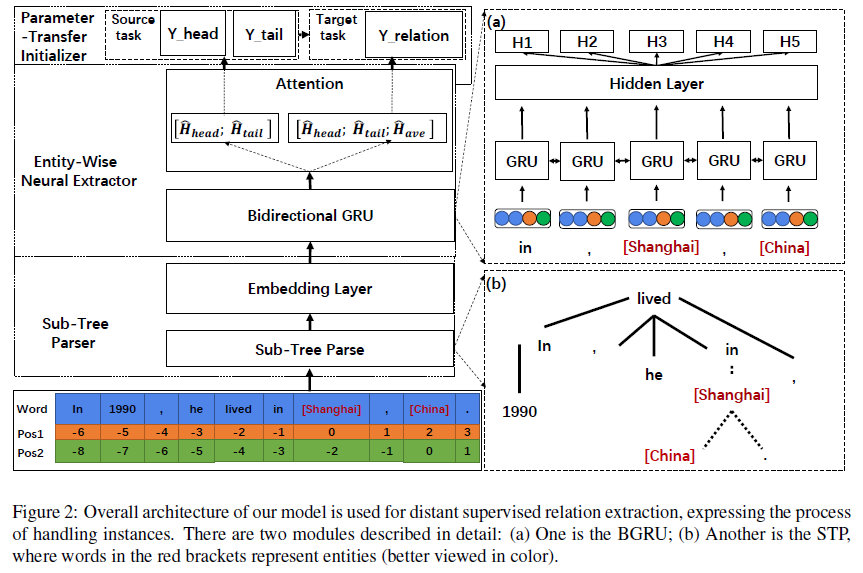

# Neural Relation Extraction via Inner-Sentence Noise Reduction and Transfer Learning

>> Tianyi Liu, Xinsong Zhang, Wanhao Zhou, 2018, EMNLP

## Motivation

To handle the problem of low-quality sentences, we have to face two major challenges: (1) Reduce word-level noise within sentences; (2) Improve the robustness of relation extraction against noise.

As for the first challenge, although the shortest dependency path tries to get rid of irrelevant words for re, it is not suitable to handle informal sentences. Moreover, word-level attention weakens the importance of entity features.

As for the second challenge, previous neural methods are always lacking in robustness because parameters are initialized randomly and hard to tune with noisy training data, resulting in the poor performance of extractor.

## Overview

To reduce innersentence noise, we utilize a novel Sub-Tree Parse (STP) method to remove irrelevant words by intercepting a subtree under the parent of entities’ lowest common ancestor. Furthermore, the entity-wise attention is adopted to alleviate the influence of noisy words in the subtree and emphasize the task-relevant features.

To tackle the second challenge, we initialize our model parameters with a priori knowledge learned from the entity type classification task by transfer learning.

## Methodology

### Sub-Tree Parser

Each instance is put into the dependency parse module to build the dependency parse tree in the first place. Then we can tailor the sentences based on the STP method. Finally, we transform word tokens and position tokens of each instance to distributed representations by embedding matrixes.

In order to reduce inner-sentence noise and extract relational words, we propose the STP method which intercepts the subtree of each instance un der the parent of entities? lowest common ancestor.

Among the parse tree, the SDP has been widely used to help models focus on relational words. However, in our observation the SDP is not appropriate in the condition that key relation words are not in the SDP.

### Entity-Wise Neural Extractor

We transform the STP into feature vectors by BGRU at first. Next, entity-wise attention combined with the hierarchical-level attention mechanism is applied to enhancing semantic features of each instance.

#### BGRU over STP

$$
h_{it} = [\overrightarrow{h_{it}}\oplus \overleftarrow{h_{it}}]
$$

In above equation, the $t$-th word output $h_{it} \in \mathbb{R}^m$ of BGRU is the element-wise addition of the $t$-th hidden states of forward GRU and backward one.

#### Entity-wise Attention

$$
\alpha_{it}^e = \begin{cases} 1 \quad t=head,tail \\ 0 \quad others \end{cases}
$$

In the above equation, $\alpha_{it}^e = 1$ if $t$-th word belongs to the head or tail entity.

#### Hierarchical-level Attention

To reduce inner-sentence noise further and deemphasize noisy sentences, we incorporate wordlevel attention and sentence-level attention as hierarchical-level attention.

##### Word-level Attention

$$
\alpha_{it}^w=\frac{\exp (h_{it}A^wr^w)}{\sum_{t=1}^T \exp (h_{it}A^wr^w)}
$$

The $i$-th sentence representation $S_i \in \mathbb{R}^m$ is computed as a weighted sum of $h_{it}$:

$$
S_i = \sum \limits_{i=1}^T (\alpha_{it}^w + \alpha_{it}^e) h_{it}
$$

##### Sentence-level Attention

$$
\begin{aligned}
S &= \sum_i \alpha_i^s S_i \\
\alpha_i^s &= \frac{\exp(S_i A^s r^s)}{\sum_i \exp(S_i A^s r^s)}
\end{aligned}
$$

### Parameter-Transfer Initializer

#### Pre-learn the Entity Type

The entity type classi fication task is considered to be the source task, which is learned before the relation extraction task.

The loss function of the source task is the negative log-likelihood of the true labels:

$$
J_e(\theta_0, \theta_{head},\theta_{tail}) = \beta||\theta_0||^2 + \sum_t(-\frac{1}{z_t}\lambda_t \sum_{i=1}^{z_t} y_i^t \log(\hat{p}_i^t)+\beta||\theta_t||^2), \quad t\in \{head, tail\} 
$$

where $\lambda_t$ is the weight of each task, $\theta_0$ is the shared model parameters, $\theta_{head}$ and $\theta_{tail}$ are individual parameters for the head and tail entity classification tasks respectively, $y^t \in \mathbb{R}^{z_t}$ is the onehot vector representing ground truth, and $\beta$ is the hyper-parameter for L2 regularization.

#### Train the Relation Extractor

$$
J_r(\theta_0, \theta_r)=-\frac{1}{z_r}\sum_{i=1}^{z_r}y_i \log(\hat{p}_i) + \beta(||\theta_0||^2 + ||\theta_r||^2)
$$

#### Optimize the Objective Function

Above process can ben summarized as the following equation:

$$
\min J(\theta)=\lambda J_e(\theta_0, \theta_{head},\theta_{tail}) + (1-\lambda)J_r(\theta_0, \theta_r)
$$

## Dataset

NYT-10 dataset