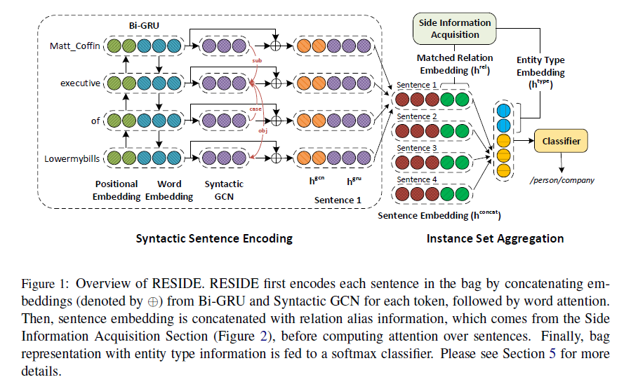
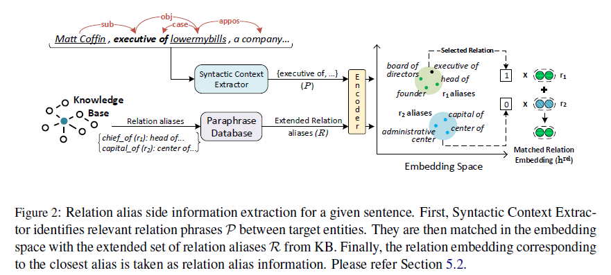

# RESIDE: Improving Distantly-Supervised Neural Relation Extraction using Side Information

>> Shikhar Vashishth, Rishabh Joshi et al. 2018, EMNLP

[Source code](http://github.com/malllabiisc/RESIDE) is available.

## Motivation

Relevant side information can be effective for improving RE. For instance, in the sentence, *Microsoft was started by Bill Gates.*, the type information of entity can be helpful in predicting the correct relation *founderOfCompany*.

Similarly, relation phrase "*was started by*" extracted by Open IE methods can be useful, give that the aliases of relatio *founderOfCompany*, e.g., *founded, co-founded*, etc., are available. 

## Overview

1. Syntactic Sentence Encoding
   
   RESIDE uses a Bi-GRU over the concatenated positional and word embedding for encoding the local context of each token. For capturing long-range dependencies, GCN over dependency tree is employed and its encoding is appended to the representation of each token. Finally, attention over tokens is used to subdue irrelevant tokens and get and embedding fro the entire sentence.

2. Side Information Acquisition

   Utilize Open IE methods for getting relevant side information.

3. Instance Set Aggregation

   Sentence representation from syntactic sentence encoder is concatenated with the matched relation embedding obtained from the previous step. Then, using attention over sentences, a representation for the entire bag is learned. This is then concatenated with entity type embedding before feeding into the softmax classifier for relation prediction.

## Methodology

### Syntactic Sentence Encoding

Although Bi-GRU is capableof capturing local context, it fails to capture long-range dependencies which can be captured through dependency edges.
The syntactic graph encoding from GCN is appended to Bi-GRU output to get the final token representation, $h_i^{concat}=[h_i^{gru};h_{i^{k+1}}^{gcn}]$.

For token $w_i$ in the sentence, attention weight $\alpha_i$ is caculated as:

$$
\alpha_i = \frac{\exp(u_i)}{\sum_{j=1}^m \exp(u_j)} \quad \text{where} \quad u_i=h_i^{concat}\cdot r
$$

where $r$ is a random query vector. The representation of a sentence is given as a weighted sum of its tokens, $s=\sum_{j=1}^m \alpha_i h_i^{concat}$.

### Side Information Acquisition

#### Relation Alias Side Information

RESIDE uses Stanford Open IE for extracting relation phrases between target entities without any predefined ontology, which we denote by $\mathcal{P}$. For sentence in following figure, Open IE methods extract "*executive of*" between entities. Further, we extend $\mathcal{P}$ by including tokens at one hop distance in dependency path from target entites.

The degree of match between the extracted phrases in $\mathcal{P}$ and aliases of a relation can give important clues about the relevance of that relation fro the sentence. In RESIDE, we further expand the relation alias set using Paraphrase database(PPDB).

For matching $\mathcal{P}$ with the PPDB expanded relation alias set $\mathcal{R}$, we project both in a $d$-dimensional space using GloVe embeddings. Then, for each phrase $p \in \mathcal{P}$, we calculate its cosine distance from all relation aliases in $\mathcal{R}$ and take the relation corresponding to the closest relation alias as a matched relation for the sentence.

We use a threshold on cosine distance to remove noisy aliases.

We define a $k_r$-dimensional embedding for each relation which we call as matched relation embedding ($h^{rel}$). For a given sentence, $h^{rel}$ is concatenated with its representations $s$. For sentences with $|\mathcal{P}|>1$, we might get multiple matched relations. In such cases, we take the average of their embeddings.

#### Entity Type Side Information

For cases when an entity has multiple types in different contexts, for instance, Paris may have types government and location, we take the average over the embeddings of each type. We concatenate the entity type embedding of target entities to the final bag representation before using it for relation classification. To avoid over-parameterization, instead of using all fine-grained 112 entity types, we use 38 coarse types which form the first hierarchy of FIGER types.

### Instance Set Aggregation

The attention score $\alpha_i$ for $i$-th sentence is formulated as:

$$
\alpha_i = \frac{\exp(\hat{s}_i\cdot q)}{\sum_{j=1}^n \exp(\hat{s}_j\cdot q)}\quad \text{where} \quad \hat{s}_i=[s_i;h_i^{rel}]
$$

where $q$ denotes a random query vector. The bag representation $\mathcal{B}$, which is the weighted sum of its sentences. The final representation $\hat{\mathcal{B}}$ can be obtained as:

$$
\hat{\mathcal{B}} = [\mathcal{B};h_{sub}^{type};h_{obj}^{type}]\quad \text{where}\quad \mathcal{B}=\sum\limits_{i=1}^n \alpha_i \hat{s}_i
$$

Finally, $\hat{\mathcal{B}}$ is fed to a softmax classifier to get the probability distribution over the relations.