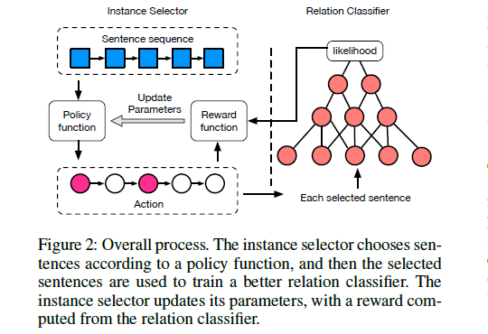

# Reinforcement Learning for Relation Classification from Noisy Data

>> Jun Feng, Minlie Huang, Li Zhao, 2018, AAAI

>> [Source code](https://github.com/unreliableXu/TensorFlow_RLRE) is available.

## Motivation

Multi-instance learning suffers from two limitations:

1. Unable to handle the sentence-level prediction.
2. Sensitive to the bags with all noisy sentences which don't describe a relation at all.

## Overview

* Instance selection problem
  
  $X=\{(x_1,r_1),\dots,(x_n,r_n)\}$, where $x_i$ is a sentence associated with $(h_i,t_i)$

* RElation classification problem
  
  Estimate the probability of $p_{\varPhi}(r_i|x_i,h_i,t_i)$

1. Each sentence $x_i$ has a action $\alpha_i$ to indicate whether or not $x_i$ will be selected as a training instance.

2. The state $s_i$ is represented by the current sentence $x_i$, the already chosen sentences among $\{ x_1,\cdots,x_{i-1} \}$, and the entity pair $h_i$ and $t_i$ in sentence $x_i$.

3. The instance selector samples an action given the current state according to a stochastic policy.

## Mehodology

### Instance Selector

#### State

The state $s_i$ represents the current sentence, the already selected sentences, and the entity pair when making decision on the $i$-th sentence of the bag $B$. 

Real-valued vector $\mathbf{F}(s_i)$ encodes the following information:
* The non-linear layer of the CNN
* The average of the vector representations of all chosen sentences
* A pre-trained knowledge graph embedding table

#### Action

The action $\alpha_i \in \{0,1\}$. We sample $\alpha_i$ by its policy function $\pi_{\Theta}(s_i,\alpha_i)$:

$$
\begin{aligned}
    \pi_{\Theta} &= P_{\Theta}(\alpha_i|s_i) \\
    &= \alpha_i\sigma(W*F(s_i) + b) \\
    &+ (1-\alpha_i)(1-\sigma(W*F(s_i) + b))
\end{aligned}
$$

where $\Theta = \{ W,b \}$

#### Reward

$B = \{ x_1,\cdots,x_{|B|} \}$, the model has a terminal reward at terminal state $s_{|B|+1}$ when it finishes all the selection.

The reward is defined as follows:
$$
r(s_i|B)=
\begin{cases}
    0& \text{i < |B| + 1} \\
    \dfrac{1}{|\hat{B}|} \sum \limits_{x_j \in \hat{B}} \log p(r|x_j)&  \text{i = |B| + 1}
\end{cases}
$$

where $\hat{B}$ is the set of selected sentences, $r$ is the relation label of bag $B$. For $\hat{B} = \emptyset$, reward = the average likelihood of all sentences.

The above reward evaluates the overall utility of all the actions made by the policy, which supervises the instance selector to maximize the average likelihood of the chosen instances.

#### Optimization

For a bag $B$, we aim to maximize the total reward. Objective function is defined as:

$$
\begin{aligned}
J(\Theta) &= V_{\Theta}(s_0|B) \\
&= E_{s_0,\alpha_0,s_1,\dots,s_i,\alpha_i,s_{i+1},\dots}[\sum \limits_{i=1}^{|B|+1}r(s_i|B)]
\end{aligned}
$$

where $\alpha_i \sim \pi_{\Theta}(s_i,\alpha_i), s_{i+1} \sim P(s_{i+1}|s_i,\alpha_i) = 1$, since $s_{i+1}$ is fully determined by $s_i$ and $\alpha_i$. $V_{\Theta}$ is the value function, and $V_{\Theta}(s_0|B)$ represents the expected future total reward that we can obtain by starting at certain state $s_0$ following policy $\pi_{\Theta}(s_i,\alpha_i)$.

$$
\Theta \leftarrow \Theta + \alpha \sum \limits_{i=1}^{|B|} v_i \triangledown_{\Theta}\log{\pi_{\Theta}}(s_i,\alpha_i)
$$

### Relation Classifier

We adopt a CNN architecture to predict relations. The CNN network has an input layer, a convolution layer, a max pooling layer and a non-liner layer.

Loss function:
$$
\mathcal{J}(\Theta) = - \dfrac{1}{|\hat{X}|}\sum \limits_{i=1}^{|\hat{X}|}\log p(r_i|x_i;\Phi)
$$

## Dataset

NYT dataset