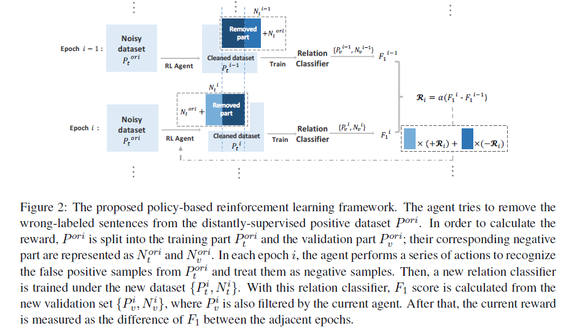
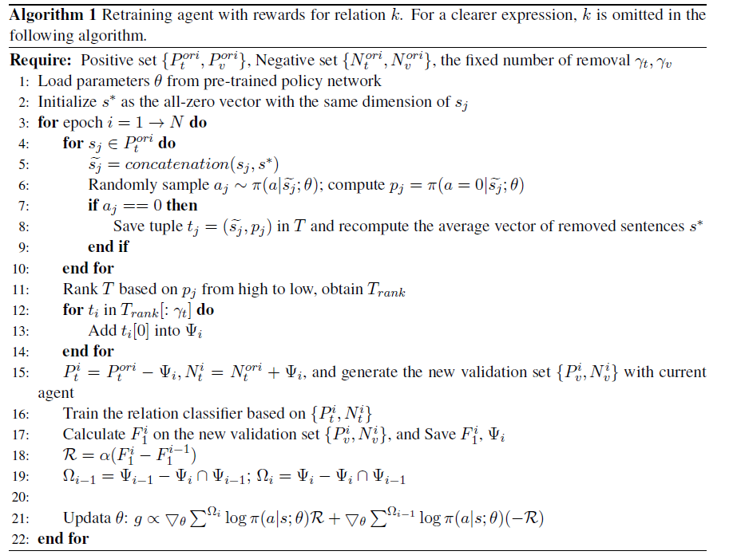

# Robust Distant Supervision Relation Extraction via Deep Reinforcement Learning

>> Pengda Qin, Weiran Xu, William Yang Wang, 2018, ACL

[Source Code](https://github.com/Panda0406/Reinforcement-Learning-Distant-Supervision-RE) is available.

## Motivation

Most of the state-of-art approaches focus on selecting one-best sentence or calculating soft attention weights over the set of the sentences of on specific entity pair.

We argue that those incorrectly-labeled candidate sentences must be treated with a hard decision, rather than being dealt with soft attention.

## Overview

We design a deep reinforcement learning agent, whose goal is to learn to choose whether to remove or remain the distantly supervised candidate instance based on the performance change of the relation classifier.

Intuitively, our agent would like to remove false positives, and reconstruct a cleaned set of distantly supervised instances to maximize the reward based on the classification accuracy. Our proposed method is classifier-independent, and it can be applied to any existing distant supervision model.

## Reinforcement Learning for Distant Supervision

Previous RL methods is not suitable for our case:
* we cannot compute the immediate reward for every operation
* the stochastic policy of the policy network is capable of preventing the agent from getting stuck in an intermediate state

Components of RL methods:

1. State
   
   In order to satisfy the condition of MDP, the current state is the concatenation of the current sentence vector and the average vector of the removed sentences in early states

2. Actions
   
   There are two actions for each agent: whether to remove or retain the current instance from the training set.

3. Rewards
   
   We use the change of performance as the result-driven reward for a series of actions decided by the agent. Compared to accuracy, we adopt the $F_1$ score as the evaluation criterion, since accuracy might not be an indicative metric in a multi-class classification setting where the data distribution could be imbalanced. In order to avoid the randomness of $F_1$, we use the average $F_1$ of last five epochs to calculate the reward.

4. Policy Network
   
   We adopt a simple CNN with window size $c_w$ and kernel size $c_k$, to model policy network $\pi(s;\theta)$. We do not choose the variants of CNN beacuase we just need a model to do binary sentence-level classification.

### Training Policy-based Agent

We adopt a supervised learning procedure to pre-train our policy network, in which way to provide a general learning direction for our policy-based agent.

#### Pre-training Strategy

For a specific relation type, we directly treat the distantly-supervised positive set as the positive set, and randomly extract part of distantly-supervised negative set as the negative set.

In order to better consider prior information during this pre-training procedure, the amount of negative samples is 10 times of the number of positive samples.

#### Retraining Agent with Rewards

Training set = $P_t^{ori} + N_t^{ori}$, and validation set = $P_v^{ori} + N_v^{ori}$. After each epoch, the agent removes a noisy sample set $\Phi_i$ from $P_t^{ori}$ according to policy $\pi(a|s)$ and we obtain a new positive set $P_t = P_t^{ori} - \Phi_i$ and the negative set $N_t = N_t^{ori} + \Phi_i$.

To measure the performance of the current agent:
First, this validation set is filtered and redistributed by the current agent as $\{P_v,N_v\}$; the $F_1$ score of the current relation classifier is calculated from it. Finally, the difference of $F_1$ scores between the current and previous epoch is used to calculate reward.

##### Removing the fixed number of sentences in each epoch

Under the restriction of fixed number, if the agent decides to remove the current state, it means the chance of removing other states decrease. Therefore, in order to obtain a better reward, the agent should try to remove a instance set that includes more negative instances.

##### Loss function

Therefore, regardless of these easy distinguished instances, the different parts of the removed parts in different epochs are the determinant of the change of $F_1$ scores. Therefore, we definite two sets:
$$
\begin{aligned}
\Omega_{i-1} &= \Phi_{i-1} - (\Phi_i \cap \Phi_{i-1}) \\
\Omega_{i} &= \Phi_{i} - (\Phi_i \cap \Phi_{i-1})
\end{aligned}
$$

If $F_1$ score increases in the epoch $i$, it means the actions of the epoch $i$ is more reasonable than that in the epoch $i-1$. In other words,$\Omega_i$ is more negative than $\Omega_{i-1}$. Thus, we assign the positive reward to $\Omega_{i}$ and the negative reward to $\Omega_{i-1}$, and vice versa.

The ultimate loss function is formulated as follow:
$$
J(\theta) = \sum^{\Omega_i}\log \pi(a|s;\theta)R + \sum^{\Omega_{i-1}}\log \pi(a|s;\theta)(-R)
$$
where $R_i=\alpha(F_1^i - F_1^{i-1})$

### Redistributing Training Dataset with Policy-based Agents

We adopt these agents as classifiers to recognize false positive samples in the noisy distantly-supervised training dataset.

For one entity pair, if all the sentence aligned from corpus are classified as false positive, then this entity pair is redistributed into the negative set.