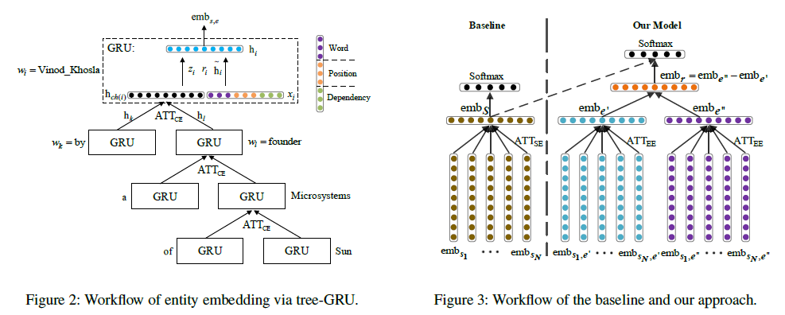

# SEE: Syntax-aware Entity Embedding for Neural Relation Extraction

>> Zhengqiu He, Wenliang Chen, Zhenghua Li, et al. 2018,AAAI

## Motivation

Some work using syntax concerns mainly on the connections between entity pairs, paying much attention on the words that link the two entities semantically, while neglects the representation of entities themselves.

## Overview

To enrich the representation of each entity, we use tree-GRU to embed the semantics of entit contexts o dependency trees. Moreover, we employ both intra-sentence and inter-sentence attentions to make full use of syntactic contexts in all sentences:

1. Attention over child embeddings in a parse tree to distinguish informative children.

2. Attention over sentence-level entity embeddings to alleviate the wrong label problem.

## Methodology

Given a sentence and its parse tree, we try to encode the focus entity pair as two dense vectors. We propose an attention-based tree-GRU to derive the context embedding of an entity over its dependency subtree in a bottom-up order.

Figure 2 illustrates the attention-based tree-GRU. Each word corresponds to a GRU node. Suppose “*Vinod_Khosla*” is the $i$-th word $w_i$ in the sentence, and take its corresponding GRU node as an example. The GRU node has two input vectors. The first input vector, denoted as $x_i$, consists of the word embedding, the position embedding, and the dependency embedding of “started $\rightarrow$ *Vinod_Khosla*”. The second input vector of the GRU node of "*Vinod_Khosla*" is the representation vector of all its children $ch(i)$ and is denoted as $h_{ch(i)}$.

### A dependency embedding

First, we employ the off-shelf Stanford Parser5 to parse the New York Times (NYT) corpus. Then, given a father-child dependency $p \rightarrow c$, the skip-gram model is optimized to predict all its context dependencies. We use the following basic dependencies in a parse tree as contexts:

$$
gp\rightarrow p \quad c\rightarrow gc_1 \quad \cdots \quad c\rightarrow gc_{\#gc}
$$

where $gp$ means grandparent; $gc$ means grandchild; $\#gc$ is the total number of grandchildren.

### Attention over child embedding ($ATT_{CE}$)

We adopt the self-attention for summing the hidden vector of the GRU nodes of its children.

Suppose $j\in ch(i)$, $h_j$ represents the hidden vector of the GRU node of $w_j$. Then the attention score of $h_j$ is:

$$
\alpha_j^i = v^{ch}\tanh(\mathbf{W}^{ch}h_j)
$$

where $v^{ch}$ and $W^{ch}$ are shared attention parameters.

Then, the children representation vector is compulated as:

$$
h_{ch(i)}=\sum \limits_{j\in ch(i)} \{ \frac{\exp(\alpha_j^i)}{\sum_{k\in ch(i)}\exp(\alpha_j^i)} \}
$$

Given the two input vectors $x_i$ and $h_{ch(i)}$, the GRU node computes the hidden vector of $w_i$ as follows:

$$
\begin{aligned}
z_i &= \sigma(W^z x_i + U^z h_{ch(i)} + b^z) \\ 
r_i &= \sigma(W^r x_i + U^r h_{ch(i)} + b^r) \\ 
\tilde{h}_i &= \tanh(W^{\tilde{h}} x_i + U^{\tilde{h}} (r_i \odot h_{ch(i)}) + b^{\tilde{h}}) \\ 
h_i &= z_i \odot h_{ch(i)} + (1-z_i)\odot \tilde{h}_i
\end{aligned}
$$

Finally, we use $h_i$ as the representation vector of the entity context of "*Vinod_Khosla*". In the same manner, we can compute the entity context embedding of "*Khosla_Ventures*".

## Augmented Relation Classification

Figure 3 shows the overall framework of our proposed approach. The input consists of three parts, i.e., the sentence embeddings , the context embeddings of $e^h$, and the context embeddings of $e^t$:

$$
\begin{aligned}
\{ emb_{s_1} \quad \cdots \quad emb_{s_N} \} \\
\{ emb_{s_1,e^h} \quad \cdots \quad emb_{s_N, e^h} \} \\
\{ emb_{s_1, e^t} \quad \cdots \quad emb_{s_N,e^t} \} \\
\end{aligned}
$$

We enhance the model by separately applying attention to both the sentence and entity context embeddings simultaneously.

### The translation strategy(TRANS)

$$
o^{see} = W^{see}(emb_{e^t} - emb_{e^h}) + b^{see}
$$

To further utilize the sentence embeddings, we compute another relation score vector $o^s$ according to the attention machenism of baselines. Then we combine the two score vectors.

$$
o^{trans} = \alpha \odot o^{s} + (1-\alpha) \odot o^{see}
$$